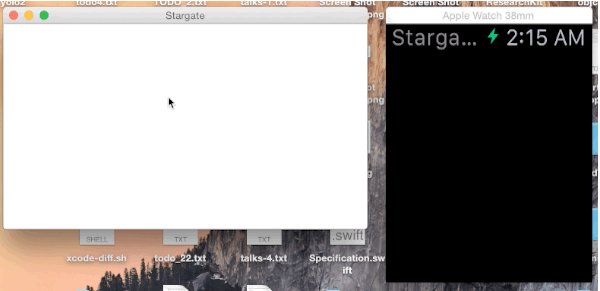

# Stargate



A communication channel from your Mac to your watch.

Providing a convenient wrapper around [MMWormhole][1] and [PeerKit][2],
Stargate leverages Multipeer Connectivity and App Groups to communicate between an
OS X application and ᴡᴀᴛᴄʜ via your iPhone. 

## Usage

Simply install it via [CocoaPods][4]:

```
pod 'Stargate'
```

### On the Mac

Send and receive messages via Multipeer Connectivity:

```swift
let stargate = Earth(applicationGroupIdentifier: "group.com.contentful.Stargate")

stargate.listenForMessage(identifier: "stargate") { (object) -> Void in
	println("Received message on Mac: \(object)")
}

stargate.passMessage("YOLO", identifier: "stargate")
```

### On the phone

Bridge messages between Multipeer and Darwin notifications:

```swift
let stargate = Abydos(applicationGroupIdentifier: "group.com.contentful.Stargate")
    
stargate.tunnel()
```

### On the watch

Send and receive messages via Darwin notifications:

```swift
let stargate = Atlantis(applicationGroupIdentifier: "group.com.contentful.Stargate")

stargate.listenForMessage(identifier:"stargate") { (object) -> Void in
	println("Received message on watch: \(object)")
}

stargate.stopListeningForMessage(identifier:"stargate")
```

## License

Copyright (c) 2015 Contentful GmbH. See LICENSE for further details.


[1]: https://github.com/mutualmobile/MMWormhole
[2]: https://github.com/jpsim/PeerKit
[4]: http://cocoapods.org
